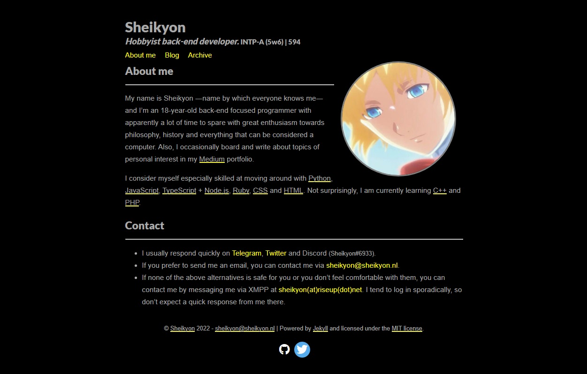

# Sheikyon

A Jekyll theme based on [Gradfolio](https://github.com/jitinnair1/gradfolio), and adjusted to my banal tastes.

## Local initialization
* Download and install [Ruby](https://https://www.ruby-lang.org/en/), on Ubuntu you can do it with `sudo apt install ruby-full` and in Manjaro first with `sudo pacman -S snapd` to install Snap, then with `sudo snap install ruby --classic` will install Ruby. On Windows you will need to download the [unofficial Ruby installer](https://rubyinstaller.org/).
* Go to the local root of the repository, and if necessary, install the missing dependencies with `bundle install`
* If necessary, also install webrick with `bundle add webrick`
* Launch the Jekyll server with `bundle exec jekyll serve`

## Aggregates

To enable the circular profile picture, you will need to modify your `index.md` file. Open it, under the third line where the title is, write the following code, it should look like this:
~~~ 
---
layout: about
title: About me
profile:
  align: right
  image: profile.png
permalink: /
published: true
---
~~~
Note that the fifth line indicates that the photo should be displayed on the right, you can modify this to be displayed on the left by replacing it with `align: left` or `align: center` so that it is displayed in the center.

Enjoy it.
