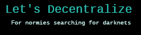

# Who's Sheikyon? 
  

Welcome to sheikyon.nl, I am Sheikyon, administrator (sysadmin) and manager of the site you are viewing at this very moment. I'm 18 years old and a full-stack focused programmer/developer with apparently a lot of time on my hands and a penchant for math, economics, and computer science. You'll occasionally see me writing about those three topics in my [Substack](https://sheikyon.substack.com/) portfolio. I currently live in Gran Canaria, Spain.

I consider myself especially skilled at moving around with [Python](https://www.python.org/), [JavaScript](https://developer.mozilla.org/en-US/docs/Web/JavaScript), [TypeScript](https://www.typescriptlang.org/) + [Node.js](https://nodejs.org/en/), [Ruby](https://www.ruby-lang.org/en/), [CSS](https://developer.mozilla.org/en/docs/Web/CSS/:lang) and [HTML](https://developer.mozilla.org/es/docs/Web/HTML). Not surprisingly, I am currently learning [C++](https://en.wikipedia.org/wiki/C%2B%2B) and [PHP](https://www.php.net/).

### Musical tastes 
  

Generally speaking, I don't have a musical genre that I'm a big fan of, but I particularly like rock and metal subgenres. I'm also hugely attracted to Techno music sub-genres, you'll be able to find some tracks [here](https://www.youtube.com/c/HATE). If you want to see a fairly complete list of what I usually listen to, you can visit my [last.fm](https://www.last.fm/user/Sheikyon).

### Political 
  

Philosophically I have considered myself an anarchist; I oppose the government and, its main personification, the State. It goes without saying that I am a staunch supporter of freedom on the Internet, the protection of privacy rights and open-source, in times where surveillance is massive and incessant. And as a staunch open-source advocate and online privacy, I'd also recommend reading some about [secure email alternatives](https://digdeeper.neocities.org/ghost/email.html) and information about the [case of Richard Stallman](https://stallmansupport.org/), founder of the free software movement and the Free Software Foundation.

### Donate
 

 * Bitcoin: [bc1qgwd87l3wya42h3lthnxugktm4958y8vsxe2huf](bitcoin:bc1qgwd87l3wya42h3lthnxugktm4958y8vsxe2huf)
 * LiberaPay: [@Sheikyon](https://liberapay.com/Sheikyon)

### Contact
  

  * I usually respond quickly on [Telegram](https://t.me/Sheikyon), [Twitter](https://twitter.com/Sheikyon), and Discord **(Sheikyon#0001)**. Also, I have a [Mastodon](https://mastodon.social/@sheikyon) account that I rarely use, or open, you can also write to me through [Keybase](https://keybase.io/sheikyon).
  * If you prefer to send me an email, you can contact me via [sheikyon@sheikyon.nl](mailto:sheikyon@sheikyon.nl) or also by [sheikyon@riseup.net](mailto:sheikyon@riseup.net). I read emails sporadically, and I will only answer those that, in my opinion, I consider important.
  * My other email is [sheikyon(at)anoxinon(dot)me](mailto:sheikyon@anoxinon.me). [Here's](key.txt) my OpenPGP key in case you want to send me an encrypted message. The OMEMO fingerprint is: **a412d356 c8ca1658 e1497ae8 6dc87740 27cdbc3b 5e8af93b 7e9ff9e7 1f0f0a10.**

  <a href="https://theswissbay.ch/pdf/">
         

  <a href="https://computability.neocities.org/">
         

  <a href="https://letsdecentralize.org/">
           

  <a href="https://omicronsetup.eu/">
           

  <a href="https://concealed.world/">
                

